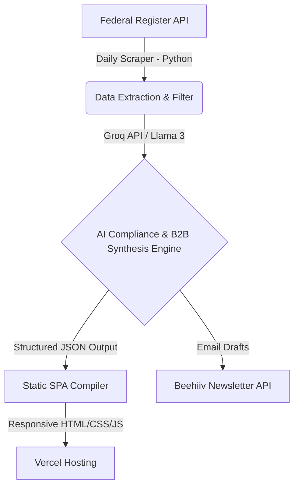

# Hi, I'm Stephen Suryapogu 👋

I am a Software Engineer specializing in building full-stack applications, automated data pipelines, and intelligent AI-powered solutions. I focus on creating high-performance, beautifully designed, and production-ready software.

---

## 🏆 Featured Project: RegRadar Weekly
**RegRadar Weekly** is an automated B2B regulatory intelligence platform that scans daily federal filings, analyzes compliance requirements with LLMs, and synthesizes them into actionable, CEO-grade business opportunities and startup blueprints.

### 🔗 Project Links
* **Live Application:** [https://regradar-pipeline.vercel.app](https://regradar-pipeline.vercel.app)

### 🛠️ Architecture & System Design

### 🌟 Technical Highlights
* **Automated Pipeline**: A serverless Python engine scrapes daily publications, filters out noise, and runs a structured multi-shot prompt chain to identify target audiences, calculate TAM, list competitors, and design weekend MVPs.
* **Premium Custom UI**: An interactive single-page application (SPA) featuring glassmorphic dark-mode aesthetics, responsive grids, real-time client-side search indexing, and smooth CSS transitions.
* **Deep-Linked Sharing**: Modals are equipped with deep-linking functionality (`index.html?modal=X#card-X`) to enable viral social sharing back to the canonical production address.
* **Automatic Publishing**: Integrates with the Beehiiv API to queue drafts of weekly issues.

> *Note: The source code for the automated scraping and AI synthesis pipeline is hosted in a private repository to secure API credentials, prompts, and database configurations. The interactive frontend is deployed live.*

---

## 💻 Tech Stack & Skills
* **Languages:** Python, JavaScript (ES6+), HTML5, CSS3, SQL
* **Backend & APIs:** FastAPI, Node.js, Express, RESTful APIs, Git, Unix Shell
* **AI & Integration:** Llama 3, Groq API, prompt engineering, structured JSON analysis
* **Frontend Systems:** Vanilla JS, Glassmorphic UI design, Responsive layouts
* **Database & DevOps:** PostgreSQL, Supabase, Vercel, GitHub Actions, AWS

---

## 📬 Connect with Me
* **LinkedIn:** [stephensuryapogu](https://www.linkedin.com/in/stephensuryapogu) *(Update with your actual URL)*
* **Email:** [stephensuryapogu@gmail.com](mailto:stephensuryapogu@gmail.com) *(Update with your actual email)*
